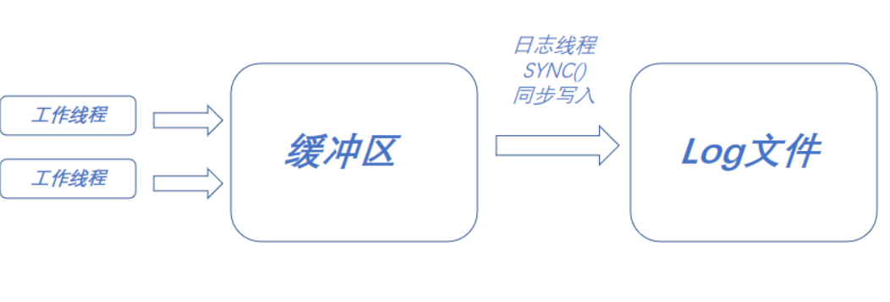
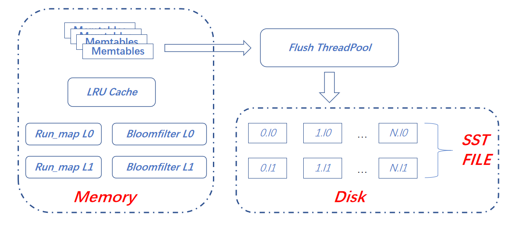
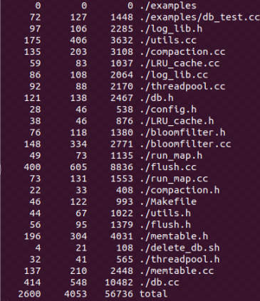

# SIMPLE_DB

SIMPLE_DB 是一个基于LSM-Tree的 NoSQL, Key-Value嵌入式数据库

## 简介
在实习期间，对[RocksDB](https://github.com/facebook/rocksdb "RocksDB")学习之后，想要自己实现一个类似的基于LSM-Tree的嵌入式数据库，在实习的业余时间完成。

## 开发语言和环境
使用C++语言，Centos 7系统开发，IDE为Vscode，使用g++ 4.8.5往上。

## 安装测试的方法
    git clone https://github.com/YJYandHCX/SIMPLE_DB
    cd SIMPLE_DB/
    make
    cp ./libSimple_db.a ./examples
    g++ db_test.cc libSimple_db.a -lpthread -std=c++11 -o test
    chmod +x ./test
    sudo ./test

## SIMPLE-DB 实现主要技术与细节
+ 主要技术如下
	+ LMS-Tree（后续结构详细介绍）
	+ 线程池
		* 采用stl的thread作为线程的库
		* 采用stl中的atomic库中的atomic_flag实现，是保证atomic_flag是无锁的，采用cas的方式实现自旋锁。
		* 采用stl::deque来做一个任务队列，里面存的类型是std::function，使用过程中将函数用std::bind打包，放入任务队列
	+ 布隆过滤器
		* 采用Rash函数
		* 采用std::bitset 作为bitmap
	* 原子操作 CAS自旋锁
	+ LRU读缓存
		* 利用stl中的map和list，map存key值和list的迭代器
		* list存key值和value值
		* 在读取过后将list 节点摘下,然后放队头
		* 若插入超过上限，就删除list的队尾元素，并通过队尾元素的key值删除map中的相应值

	+ 日志系统
		* 采用atomic_flag实现线程安全
		* 实现一个写缓冲区
		* 用一个线程做sync同步写入

## SIMPLE-DB的主要结构
### LSM-Tree 结构
SIMPLE-DB采用了LSM-Tree结构，但是由于只是模拟，只采用了2个Level，L0和L1。结构如下图：

### 写入的流程
在插入K-V过程中，先把写入内存中的memtables。在memtables的数目到达上限之后，会使用std::bind打包好放入flush threadpool 的任务队列中，异步的写入硬盘。
+ 其中写入的流程有：
    * memtables进行排序
    * 设置所有的值到L0布隆过滤器
    * 设置把memtables的最大值和最小值写入run_map
	* 若L0的文件数目超过限制，触发compaction，把L0的文件打包，排序放入L1中。

#### Memtables的结构
由于精力问题只实现基于stl中的vector，实现基于Vector的memtable。

#### bloomfilter
采用Rash函数作为函数，输入不同的质数作为不通的哈希函数。

### 读取的流程
+ 在读取的过程中主要流程如下：
	+ 先在memtables中查找
	+ 若在memtables中找不到，就在LRU-cache中查找
	+ 然后查L0的布隆过滤器，若结果阳性，在L0对应的run_map 中找出所有起始值比查询小的，结束值比查询值大的。然后读取这些文件查询。若还是查不到到L1 执行一样的操作
	+ 若找不到返回“None”，若找到返回值并设置K-V设置到LRU-cache中。

### 删除的流程
类似与读取的流程，不同之处就是最后得删除缓存中的该值。

## 代码量

## 性能测试

## 不足与反思
+ 数据库性能比较差
	* 原因：这里主要是一开始想法做成二进制流，但是懒。就先将string 转为bitset然后有转成string存储
	* 方法： 采用类似protobuf等协议，结构化类然后转成二进制文件存储。

+ 线程池采用自旋锁，导致cup占用比较高
	* 解决方法： 后续采用stl条件变量加mutex的组合

+ 没办法多线程写入
	* 原因：其实是设计的的可以多线程写入，但是不知道哪个地方delete了两次，所以会报错。
	* 方法：都改成智能指针shared_ptr
+ 不支持流式日志写入
	* 方法：重载<<实现流式的写入
+ 后续实现持久化和原子性
	* 实现wal
+ 考虑后续数据库的复制问题
	* 实现类似mysql bin日志，或者类似redis的AOF持久化或者RDB持久化
